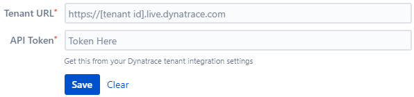
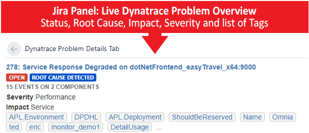
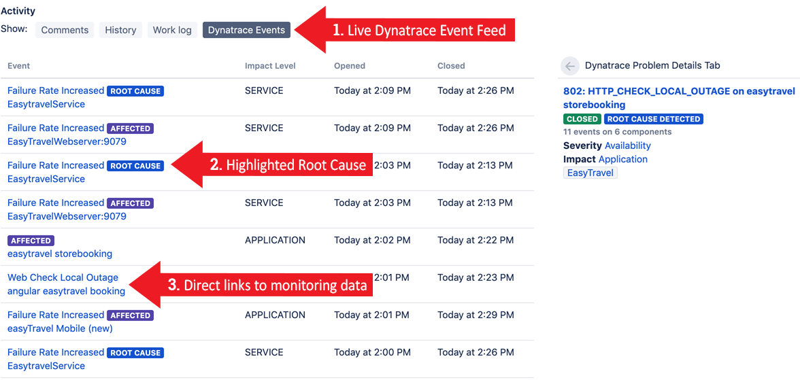
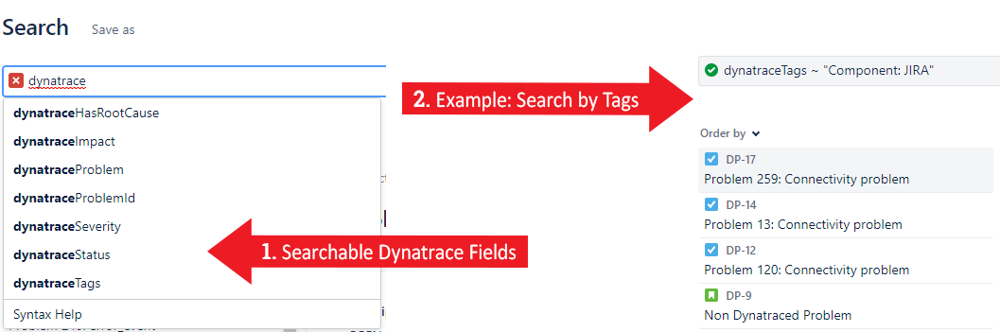
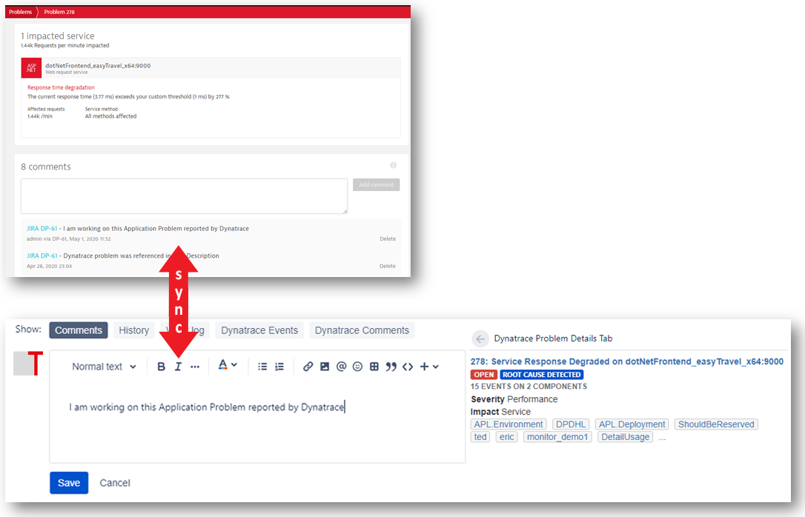
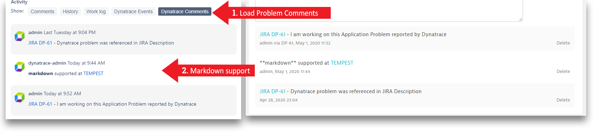
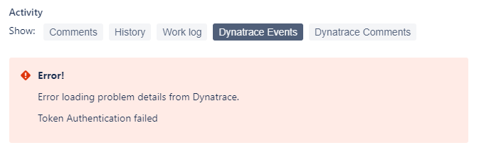

# Dynatrace for Jira Cloud

The [Dynatrace for Jira Cloud](https://marketplace.atlassian.com/apps/1217645/dynatrace-for-jira-cloud?hosting=cloud&tab=overview) Connect Add-On enables several Use-Cases for [Jira Cloud](https://www.atlassian.com/software/jira)
* Live Dynatrace Problem Status and Problem Events in JIRA ticket
* Automatically link JIRA tickets with Dynatrace Problems
* Synchronize JIRA ticket comments with Dynatrace Problems
* Direct links to root cause dashboards from your JIRA ticket
* Enable JQL queries based on Dynatrace Problem data: severity, impact, tags, ...

Originaly started as a [Dynatrace](https://www.dynatrace.com) plugin, but based on an agreement with them, we started to provide support and enhancements for this plugin.

Want to see the Add-On in action? [Watch this video](https://www.youtube.com/watch?v=px4ec9C32I4).

Want to learn more about this Add-On creation? [Read Atlassian Connect blog](https://www.dynatrace.com/blog/atlassian-connect-ing-devops-tools-jira-xmatters-dynatrace/).

Interested in **Jira Server** on premise version? [We got it!](https://www.tempest.sk/dynatrace-integration-for-jira/)

## Getting started with this Add-On
In order to use this integration you need
1. A Dynatrace FullStack instance (Managed or SaaS): [Get your own Dynatrace SaaS Trial](https://dynatrace.ai/tempest).
2. A Dynatrace API Token: In Dynatrace go to Settings -> Integration -> Dynatrace API and create a new token (with proper permissions - read problems and add comments).
3. A JIRA cloud instance: [Get your JIRA Cloud instance](https://www.atlassian.com/software/jira/try).
4. (optionally but recommended). Configure the [Dynatrace to JIRA Integration](https://www.dynatrace.com/blog/integrate-jira-issue-tracking-dynatrace-environment/).

In your JIRA instance 
1. Navigate to Apps -> Find new apps and search for "Dynatrace for Jira Cloud" or install the Add-On directly from it`s [marketplace page](https://marketplace.atlassian.com/apps/1217645/dynatrace-for-jira-cloud?hosting=cloud&tab=overview).
2. Once the Add-On is installed click on "Configure".
3. Enter your Dynatrace Tenant URL as well as a Dynatrace API token.

4. Hit Save.

**And thats it!**

## Key Use Cases explained
Add-On can be used for the following use cases.

### Linking a JIRA ticket with a Dynatrace Problem
The linkage between a Jira ticket and a Dynatrace Problem is done by storing the Dynatrace Problem ID as an [Entity Property](https://developer.atlassian.com/jiradev/jira-platform/building-jira-add-ons/jira-entity-properties-overview) on the Jira ticket. The property is named "dynatraceProblemId" and contains a JSON object with details such as "Unique Dynatrace Problem ID", "Severity", "Impact", "Tags", "Status". The property itself is not visible to the end user. End users can however use JQL (JIRA Query Language) to search for Jira tickets that are associated with a Dynatrace Problem.
The "dynatraceProblemId" entity property is set in different scenarios
1. Our Dynatrace to Jira Integration will create JIRA tickets and automatically set this property.
2. 3rd party tools such as xMatters set this property when forwarding a Dynatrace Problem to JIRA.
3. Our JIRA Add-On scans and parses links to Dynatrace Problem URLs in Jira ticket description. If detected the entity property is stored.

In order to display Add-On panels and tabs, both tenant credentials and issue property have to be set.

### Live Problem Status Overview
If the JIRA ticket is linked with a Dynatrace Problem the Add-On will query LIVE data through the Dynatrace Problem REST API and display the information in a panel.

Provided information contains

* ID and a name as an url to the problem
* Status
* Root cause flag
* Number of detected events
* Number of affected components
* Severity
* Impact
* Affected entity tags - including both key and value if provided

### Live Problem Events Feed
The Dynatrace Events tab automatically pulls in all correlated problem events from the linked Dynatrace Problem. The list highlights special events and provides direct links to Dynatrace root cause dashboards.
Event URLs point at entity detail page with scope set to the linked problem.

### JQL Support
The linked Dynatrace problem data including Tags, Impact, Severity, Status, ... is indexed by JIRA. This allows JIRA users to query JIRA tickets that are linked to Dynatrace Problems. This is especially useful to search for related problems.

### Synchronize Comments
If you add a comment to a JIRA ticket we do not only scan for a link to a Dynatrace Problem to link the ticket with that problem. In case the JIRA ticket is already linked we push the comment to the Dynatrace side so that the comment can be seen in both JIRA and Dynatrace.
Dynatrace comments are displayed in Jira in a dedicated Dynatrace Comments tab. Comments are displayed in chronological order and support full markdown syntax.

### Error
If it is possible, we try to handle errors visually with appropriate message.

## What's next?
Give us feedback on further extensions to the Add-On. Which use cases are missing? Would you also like to see tighther integrations with other Atlassian tools?

Closest on our scope are
* multiple environments support - as we often have more than one environment (prod, dev..)
* JQL filter by environments

## License

You can find the license to this app [here](License.md).
